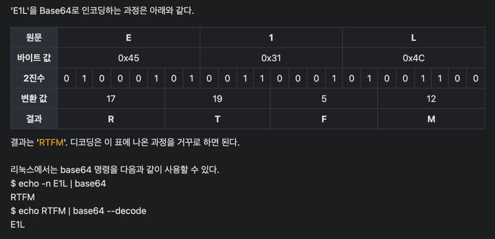

## 인코딩이란? 

- 인코딩(encoding)은 정보의 형태나 형식을 
  - 표준화, 
  - 보안, 
  - 처리 속도 향상, 저장
  - 공간 절약 등을
- 위해서 다른 형태나 형식으로 변환하는 처리 혹은 그 처리 방식

- 단순히 보안을 위해 인코딩한다고 생각했는데, 표준화, 처리속도 향상, 절약 등의 역할이 있을 수 있다고 한다. 

## Base64

[Base64 참고글](https://medium.com/atant/base-64-%EC%9D%B8%EC%BD%94%EB%94%A9%EC%97%90-%EB%8C%80%ED%95%B4-%EC%84%A4%EB%AA%85%ED%95%98%EC%8B%A4-%EC%88%98-%EC%9E%88%EB%82%98%EC%9A%94-a67f204bb3b2)

### 탄생 배경 

인터넷 초기에는 거의 모든 커뮤니케이션이 텍스트로 기반

당시에는 이메일이 주 통신 수단이었기 때문에 -> 데이터 전송에는 SMTP (Simple Mail Transfer Protocol) 프로토콜 기반이였다. 

**SMTP는 모든 메시지를 7-bit의 ASCII로 제한되어 있었다**. 

하지만 **이미지, 영상 또는 오디오와 같은 데이터를 메일 첨부 파일로 보내려면 8-bit ASCII가 필요**했다. 

데이터 교환을 위한 8-bit 패턴은 훨씬 나중에 표준화되었기 때문에 불가능했었다.

7-bit 만 수용하는 채널에서 8-bit 데이터(Octet)를 전송하려면 약간의 변환이 필요했다. 

-> 이때 **MIME** (Multipurpose Internet Mail Extension)과 같은 새로운 인터넷 표준이 등장했다. 

MIME은 더욱 확장된 기능들이 있었기 때문에 -> 이메일 첨부 파일로 멀티미디어 데이터를 주고 받을 수 있게 해줬다. 

사용자는 SMTP 채널을 통해 8-bit 이상의 데이터를 주고 받을 수 있게 된것이다.

---
#### MIME 왜 중요한가?

MIME은 **Base64 인코딩이라는 기본 인코딩 체계를 사용**한다. 

일반적으로 데이터 전송 중 인쇄 가능한 문자만 허용하는데,

Base64 인코딩을 구현함으로써 SMTP와 같은 7비트 형식만 허용하는 채널에서 8비트 ASCII 및 Non-ASCII 데이터를 전송할 수 있게 된것이다.

### Base 64 인코딩이란?

- Base 64 인코딩은 이진-텍스트(binary-to-text) 체계로, 이진 데이터를 64진법으로 표현된 ASCII 코드 문자열 형태로 나타냄 
- 기본적으로 6-bit 마다 64자 기호로 인코딩된다. Base 64 기호 중에는: `A-Z`, `a-z`, `0–9`, `+`, `/`. 
- 마지막에 비트가 모자르다면 `=` 패딩(padding) 문자를 사용하여 채운다. 
- 이는 64개의 서로 다른 문자를 사용하여 이진 데이터를 표현하기 때문에 “Base 64”라는 이름이 붙여졌다.

#### 왜 Base64인가? 63이나 65가 아닌 이유는?
인코딩은 여러개의 기호가 있을 수 있지만 기호의 수가 특정 비트에 맞춰지면 컴퓨터가 처리하기에 더 적합하게 사용될 수 있다.

예를 들어 16진수(hex)는 4-bit로 표현할 수 있는 값의 수인 16개의 기호를 가지고 있다. 같은 맥락에서 6-bit는, 63이나 65보다도, 64개의 숫자로 기호를 표현할 수 있다.

#### Base 64 인코딩은 어떻게 작동하나요?
1. 8-bit로 표현된 이진 데이터 스키마를 -> 6-bit chunk로 그룹화 한 다음, 
2. 각 chunk를 Base 64 문자 테이블에서 매핑
3. 그 결과 생성된 ASCII 문자열은 **텍스트 기반 채널을 통해 전송 가능한 인코딩된 데이터를 나타낸다**.

- 현재는 ASCII 대신 UTF-8 을 기본으로 인코딩 디코딩 된다!

## 근데.. 그냥 이진수로 사용하면 안되나?
상황에 따라 다를 수 있다. 예를 들어 이메일에 이미지를 첨부하는 경우 인코딩하는게 의미 없다 그냥 그대로 첨부하면 된다.

하지만 데이터를 텍스트 형태로 사용할 수 있는건 유용한 경우가 많이 있다. 

 ->특히 텍스트 데이터 사용만 제한 되어 있거나 텍스트로 사용하는게 편리한 경우이다.

예를 들어 JSON 구조는 순전히 텍스트 형식이므로 텍스트로 인코딩하는게 필요하다. 
HTML은 또한 텍스트 문서이다. 
이미지와 같은 콘텐츠를 포함할 수 있지만, 결국엔 텍스트 문서이기 때문에 모든 데이터는 텍스트로 변환해줘야 전송할 수 있다. 

그리고 가장 자주 사용되는 환경은 **네트워크 전송**이 아닐까 싶다. 

클라이언트와 서버간 http 프로토콜을 통해 리소스를 주고 받을때 텍스트 형식이 가장 빠르고 효과적이여서 아직도 사용되고 있다.