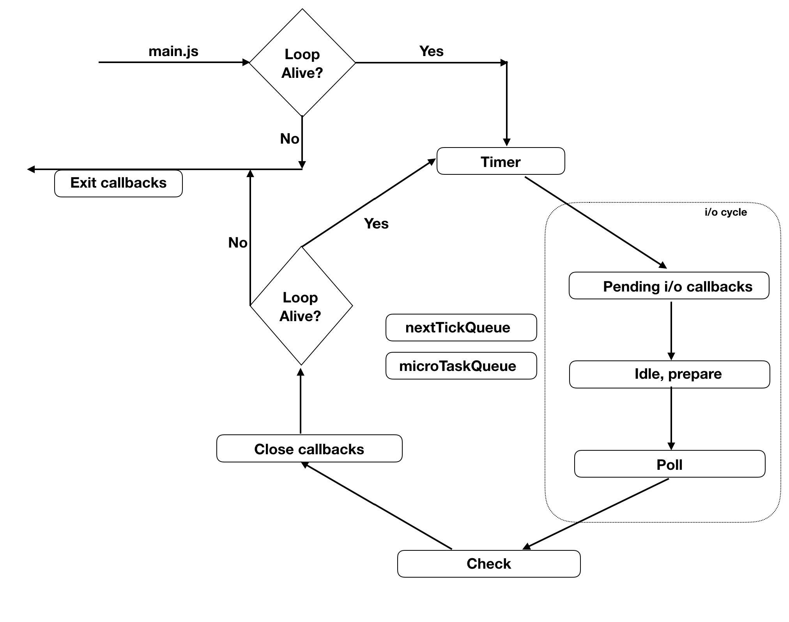

- Node.js 이전 자바스크립트는 브라우저에서 주로 실행되는 언어
- 브러우저에는 V8 같은 자바스크립트 엔진이 들어있다. 

- 자바스크립트 언어 자체가 **싱글 스레드**이고, **이벤트 기반 아키텍처**
- 따라서 자바스크립트 런타임인 Node.js도 자연스럽게 싱글 스레드로 구현되고, 이벤트 기반 아키텍처를 구현 

### 싱글 스레드 
- V8은 **자바스크립트를 실행하는 힙과 콜 스택**을 가지고 있고,
- **싱글 스레드**로 실행됨
  - -> 싱글 스레드라는 뜻은 -> 콜 스택이 하나!
- 콜 스택이 하나라서 -> 한 번에 하나의 작업만 가능 

> **콜 스택**
> - 자바스크립트 엔진이 **함수 호출을 관리하는 방식**
> - 현재 실행중, 대기중인 함수 호출들이 쌓임 
> - 처음 실행될 떄 전역 컨텍스트가 추가됨 !
> 
> [콜 스택](./콜%20스택.md) 

### 이벤트 기반 아키텍처 

- Node.js 처럼 싱글 스레드로 요청을 처리하는 서버가 있다. 
- 한번에 하나를 처리하는 서버에 0.1초가 걸리는 요청이 동시에 100개가 온다면, 마지막 요청은 10초를 기다려야 응답을 받을 수 있다. 
- 멀티 스레드 언어라면, 스레드를 100개 만들어서 동시에 처리할 수 있지만, 
  - 싱글 스레드 언어에서는 이런 문제가 발생한다.
- 이런 문제를 해결하기 위해 **이벤트 기반 아키텍처**를 사용한다.

---
- 콜 스택에 쌓인 작업을 다른 곳에서 처리한 다음 
- -> 처리가 완료되었을 때 알림을 받으면 
- -> 스레드가 하나라도 빠르게 처리 가능!

1. 자바스크립트 코드는 **V8의 콜 스택에 쌓이고**,  **I/O 처리가 필요한 코드는 이벤트 루프에 보내게 됨** 
2. 이벤트 루프에서는 말 그대로 루프를 실행하면서 -> **운영체제 또는 스레드 워커에 I/O 처리를 맡김**
3. 스레드 워커와 운영체제는 받은 요청에 대한 결과를 -> 이벤트 루프로 돌려주고, 
4. 이벤트 루프에서는 결과값에 대한 코드를 콜 스택에 다시 추가

- Node.js는 오래 걸리는 일을 이벤트 루프에 맡긴다! 
- 이벤트 아키텍처를 구현해서, 10ms인 요청이 동시에 100개가 오더라도 -> 그 요청을 거의 동시에 처리 가능!

[태스크 큐](./태스크%20큐.md)

### 이벤트 루프 
- Node.js에서는 이벤트 기반 아키텍처를 구축하는 데 반응자 패턴(reactor pattern)을 사용

> **반응자 패턴**
> - 이벤트 디멀티플렉서와 이벤트 큐로 구성됨
> - 이벤트를 추가하는 주체와 / 해당 이벤트를 실행하는 주체를 분리(디커플링)하는 구조
> - 반응자 패턴에서 이벤트 루프는 필수
> - Node.js의 이벤트 루프는 libuv에 있음 
> - 각 운영체제의 계층을 추상화한 기능을 제공 
> 
> [event-loop](https://www.voidcanvas.com/nodejs-event-loop)

- 이벤트 루프는 여러 개의 FIFO 큐로 이루어짐 
- 각 단계를 돌면서 각 큐에 쌓인 이벤트를 모두 처리 

1. 이벤트 루프의 시작 및 각 반복의 마지막에 루프가 활성화 상태인지 체크 
2. 타이머 단계에서는 타이머 큐를 처리 (setTimeout, setInterval 을 여기서 처리!)
3. 펜딩 I/O 콜백 단계에서는 다음 반복으로 연기된 콜백을 처리
4. 유휴(idle) , 준비(prepare)단계는 내부적으로 사용
5. Poll 단계에서는 새로운 연결(e.x. 소켓)을 맺고, 파일 읽기 등의 작업을 함. 각 작업은 비동기 I/O를 사용하거나, 스레드 풀을 사용 
6. 검사(check) 단계에서는 setImmediate() 를 처리 
7. 종료 콜백 단계에서는 콜백의 종료 처리를 함 

여기서 `nextTickQueue`, `microTaskQueue`는 조금 특별한 장치입니다
- 각 단계의 사이마다 nextTickQueue와 microTaskQueue에 있는 작업을 **먼저 실행**하기 때문!
- 즉, 타이머 단계가 끝나면 -> nextTickQueue와 microTaskQueue에 있는 작업을 먼저 실행
- 펜딩 I/O 콜백 단계가 끝나면 -> 그사이에 쌓인 nextTickQueue와 microTaskQueue 실행

---
따라서 nextTickQueue와 microTaskQueue에 코드를 추가하면 조금은 우선순위가 올라간다
- Node.js 의 `process.nextTick()`함수로 nextTickQueue에 코드를 추가할 수 있음
- microTaskQueue에는 **Promise로 만든 콜백 함수**가 추가됨

> **Promise 란**
> - 비동기 함수를 동기 함수처럼 사용하는 객체

- nextTickQueue가 > microTaskQueue보다 우선순위가 높다!

- 이벤트 루프에서 
  - OS의 **비동기 I/O 기능을 사용**하거나, 
  - 또는 **스레드 풀을 사용해서 모든 작업을 비동기**로 처리 
- 이벤트 루프에서는 여러 큐를 사용해 -> 특정 우선순위대로 작업들을 처리

